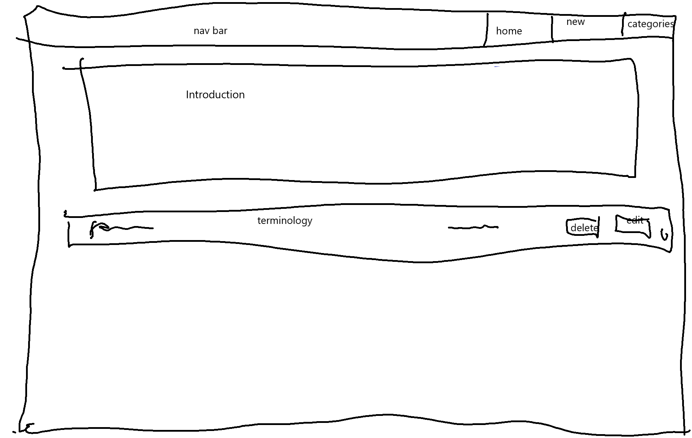
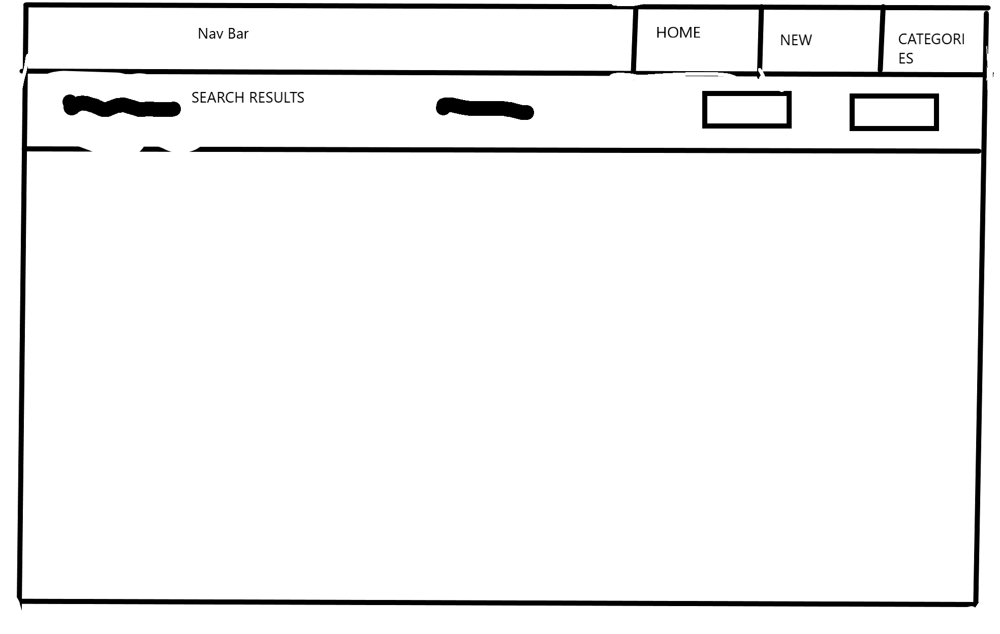
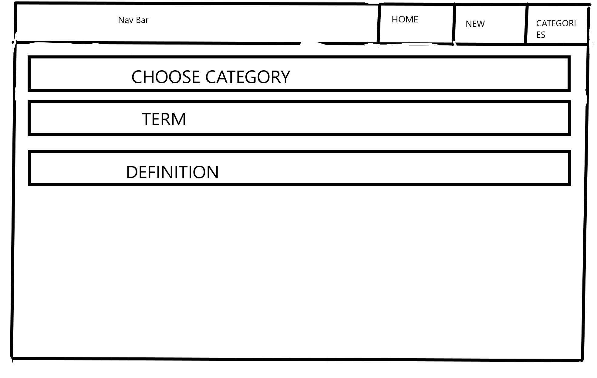

 

# Data Centric project

## Introduction

Welcome to my data centric project page.
This site was created with the idea in mind of someone who might be new to a gaming community, or someone who does not understand the jargon that is used when people play games. It is designed as a community driven page where people are able to add, delete and modify terms that are commonly used within gaming communities, which in turn can be searched for to see a definition of the term, to allow a bettter understanding.

## UX

This website has been designed with respponsiveness in mind. it is designed to work on all devices.

This website was designed to be functional, rather than "pretty" my orignal idea was to have something someone could go to for a quick reference guide, rather than something that someone could spend hours browsing through. Because of this the design of the UI is very minimal.

### User Stories

* As a user, I want to be able to quickly look at gaming terminology to find out its meaning, so that i can understand their meanings.
* As a user, I want to be able to search for specific terms, so that I can quickly find what i am looking for.
* As a user, I want to be able to easily see if a term i have searched for is in the database, so that I can look elsewhere if needed.
* As a user, I want to be able to add terms I come across, so that I can help keep the list up to date.
* As a user, I want to be able to delete incorrect terms, so that I can prevent people from receiving incorrect information.
* As a user, I want to be able to edit terms that may be out of date or wrong, so that i can help keep the list up to date.

### Mockups

As stated above this website was designed with function in mind over looks, as such the designed for the site took on a more minimalist approach and only contained elements on the page that were deemed to be necessary.

## Features

Users of this site are able to do a number of things on this site:

* Users are able to add terms they come across, or know.
* Users are able to edit terms that are already in the database.
* Users are able to delete terms from the database.
* Users are able to search for specific terms they are looking for.

### Left to implement

The next step would be to develop a log in function, so people had to log in in order to add, delete or edit any terms.
I would also like to implement a voting system so that people can vote on their favourite terms.

## Technologies used

The technologies used when creating this website are:
* Languages
  * HTML - used to code the frontend of the site
  * CSS - used to style the site
  * Python - used to code the backend of the site
  * Flask - Used as the framework of the site.
  * MongoDB - the database that was used
  * materialize - used to help style the site.
  * Heroku - used to host the site to the public internet.

## Testing

The website was tested manually. the website was tested to ensure that the development of the features worked as intended.

A copy of the testing report can be found [here](https://github.com/ALDrinkwater1989/data-centric-project/blob/master/tests.md)

The site was tested on various screen sizes to ensure that it looked correctly on different sizes. 

the developer tools in Firefox were used to simulate these.

## Known Bugs

As of writing this document the only known bug is that once a record has been save, you are unable to update the category it has been assigned. I believe that this is due to some code being missing, however i am not able to work through this problem.

## Deployment

The website was developed using the gitpod IDE and made use of Github for version control and development history. the final version of the website is hosted on Github and heroku

The website has been deployed on Heroku. a live link can be found [here](https://alex-datacentric-jargon.herokuapp.com/)

As of writing this doucment there are no differences between the production version and development version.

## Credits

Credit for the initial idea of this website goes to my Destiny 2 game clan, who regularly use random gaming terms, or make up new ones themselves. When gaming with them one night, I thought it would be a fun idea to create a repository of gaming terms.

### Acknowledgments

The main look of the site was inspired by the data centri mini project. as it was a good basis for what i needed from the website. as well as providing the backend code for the site that i needed.
